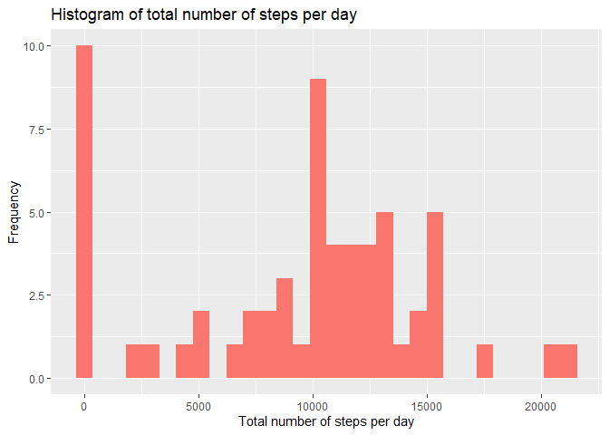
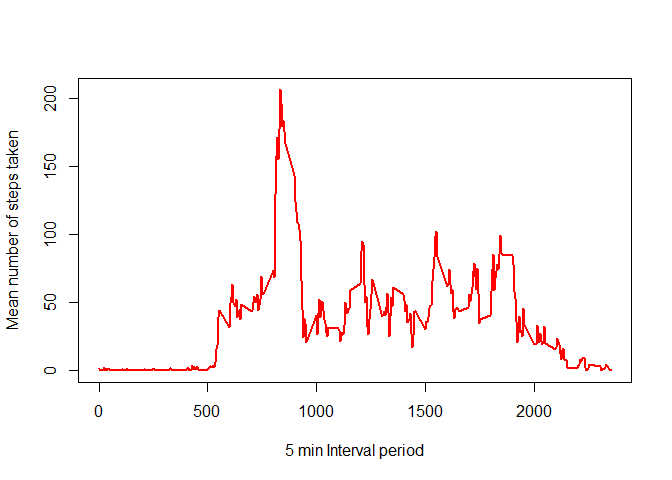
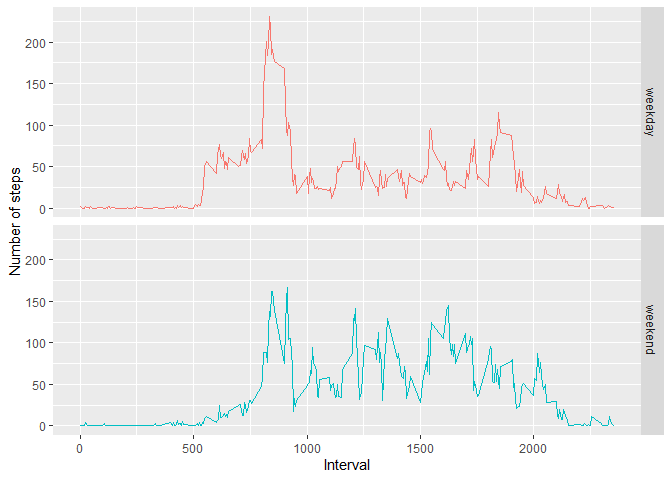

---
title: 'Reproducible Research: Peer Assessment 1'
output:
  html_document:
    keep_md: yes
  word_document: default
---


```
## Warning: package 'ggplot2' was built under R version 4.0.2
```

```
## 
## Attaching package: 'dplyr'
```

```
## The following objects are masked from 'package:stats':
## 
##     filter, lag
```

```
## The following objects are masked from 'package:base':
## 
##     intersect, setdiff, setequal, union
```
## Loading and preprocessing the data
Using read.csv, load in activity.csv which should be in your working directory.  
Convert the date column in the activity data frame to class Date.

```r
activity <- read.csv("activity.csv", na.strings ="NA")

activity$date <- as.Date(activity$date, "%Y-%m-%d")
```


## What is mean total number of steps taken per day?
First, we find the total number of steps taken each day with tapply, then plotting it on a nice histogram to show the range of frequencies for  these total number of days.

```r
totalPerDay <- tapply(activity$steps, factor(activity$date), sum, na.rm=TRUE)
totalPerDay <- data.frame(totalPerDay)
diagram <- qplot(x = totalPerDay, fill ="red",data = totalPerDay , main = "Histogram of total number of steps per day", xlab = "Total number of steps per day", ylab = "Frequency")
diagram <- diagram + theme(legend.position = "none")
plot(diagram)
```

```
## `stat_bin()` using `bins = 30`. Pick better value with `binwidth`.
```

<!-- -->

Now, we can find the mean and median total number of steps taken per day.


```r
meanDay <- mean(totalPerDay[[1]])
medianDay <- median(totalPerDay[[1]])
```
Mean total number of steps taken per day are 9354.2295082  
Median total number of steps taken per day are 10395


## What is the average daily activity pattern?


```r
Interval_mean <- aggregate(activity$steps, by = activity[3], mean, na.rm=TRUE, simplify = FALSE)
colnames(Interval_mean) <- c("interval","mean")
Interval_mean$mean <- as.numeric(Interval_mean$mean)
plot(Interval_mean$interval, Interval_mean$mean, type ="l", xlab = "5 min Interval period",ylab="Mean number of steps taken", col = "red", lwd = 2)
```

<!-- -->

Highest number of steps, average across the day is 206.1698113, and the interval is 835.


## Imputing missing values


```r
missing <- is.na(activity$steps)
```
There are 2304 number of rows with missing values! Trying to replace the missing values...


```r
newActivity <- activity

# replace missing values with mean values at relevant intervals
newActivity <- left_join(newActivity, Interval_mean,by="interval") %>% 
              mutate(steps = ifelse(is.na(steps),mean,steps)) %>%
              select(steps, date, interval)
# calculating total number of steps taken per day
newTotal <- aggregate(newActivity$steps, by = newActivity[2], FUN = sum, na.rm=TRUE, simplify = FALSE)
colnames(newTotal) <- c("date","steps")
newTotal$steps <- as.numeric(newTotal$steps)

#calculate mean and median
newMean <- mean(newTotal[[2]])
newMedian <- median(newTotal[[2]])

newDiagram <- qplot(steps,data = newTotal, fill= "red", geom = "histogram",main = "Histogram of total number of steps per day", xlab = "Total number of steps per day", ylab = "Frequency")
diagram <- diagram + theme(legend.position = "none")
plot(diagram)
```

```
## `stat_bin()` using `bins = 30`. Pick better value with `binwidth`.
```

<!-- -->

The mean now is 1.0766189\times 10^{4} and the median now is 1.0766189\times 10^{4}!  
Looks like replacing the missing values with the average number of steps in that interval has caused the mean and median to increase!


## Are there differences in activity patterns between weekdays and weekends?


```r
activityDay <- mutate(newActivity, "Day"= weekdays(newActivity$date, abbreviate= TRUE))
activityDay$Day <- gsub("S(at|un)","weekend",activityDay$Day)
activityDay$Day[!grepl("weekend",activityDay$Day)] <- "weekday"

activityDay$DayInt <- paste(activityDay$Day, activityDay$interval, sep= ":")
pattern <- with(activityDay, tapply(steps, DayInt, mean,na.rm=TRUE))
pattern <- data.frame(DayInt = names(pattern), steps = pattern) %>% 
          separate(col="DayInt", into = c("Day","interval"),sep=":", convert = TRUE)
patternDiag <- ggplot(data= pattern, aes(interval, steps, color = Day)) +geom_line()+facet_grid(pattern$Day~.) 
patternDiag <- patternDiag +  theme(legend.position = "none") +labs(x="Interval", y = "Number of steps")
plot(patternDiag)
```

<!-- -->

For the weekdays, there seems to be a spike around the interval 800, but weekends has more constent number of steps throughout the entire period. 
